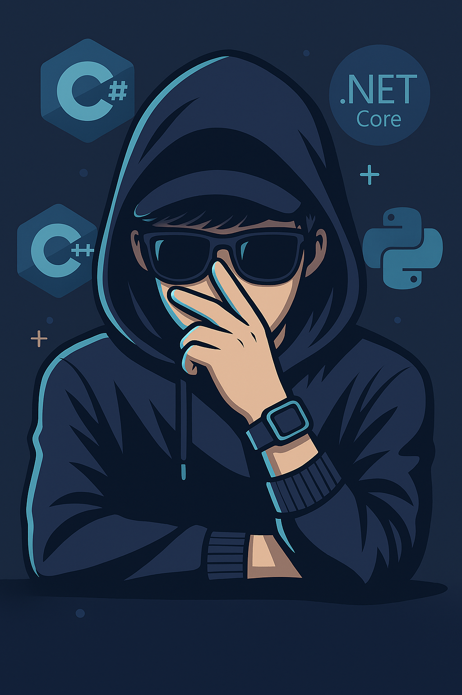

# 👋 Hola, soy Juan Jose Tito Escobar

|  | Junior .NET Backend Developer especializado en ASP.NET Core. |
|--------------------------------------|------------------------------------------------------------------------------------------------------------------------------------------------------------------------------------------------------------------------------------------------|

## 🔧 Qué hago y me apasiona

- Desarrollo **APIs web con .NET** y manejo de bases de datos con **Entity Framework Core** (SQL Server, PostgreSQL).  
- Integración de **LLMs e IA** en aplicaciones backend usando **Python y C#**.  
- Implementación de **autenticación y seguridad** con **JWT e Identity Framework Core**.  
- Construcción de proyectos escalables que ya están en uso, como **Creaciones Nikolet**, donde desarrollé el backend completo y se encuentra desplegado.  

---

## 📈 Mi objetivo

Seguir aprendiendo y perfeccionando mis habilidades en desarrollo backend e inteligencia artificial, creciendo hasta convertirme en un experto en las tecnologías que manejo.  

---

## 🏆 Logros y certificaciones

- Participación en competencias de programación **ICPC**.  
- Certificados en cursos de desarrollo backend y machine learning en **Udemy**.  
- Proyectos propios y colaborativos desplegados y en uso real.  

[Ver Certificados](/Cretificados.md)

---

## 🔧 Tecnologías y herramientas

| Lenguajes | Frameworks / Librerías | Bases de datos | Seguridad / Autenticación |
|-----------|----------------------|---------------|---------------------------|
| C#        | .NET Web API, Entity Framework Core | SQL Server, PostgreSQL | JWT, Identity Framework Core |
| Python    | LLMs, ML libraries   | -             | -                         |
| C++       | Lógica y algoritmos  | -             | -                         |
| HTML/CSS/JavaScript | Frontend web | - | - |

## 📫 Contáctame

- [LinkedIn](https://www.linkedin.com/in/juan-jose-tito-8755a8248/)  
- [Email](mailto:juan.tito.dev@gmail.com)  
